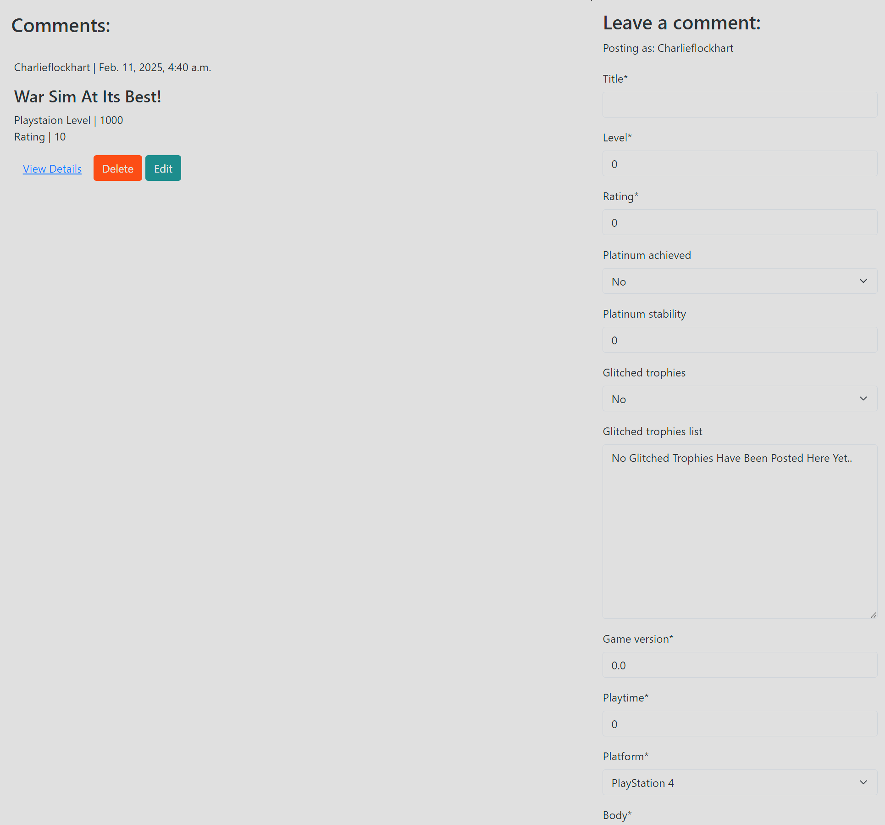
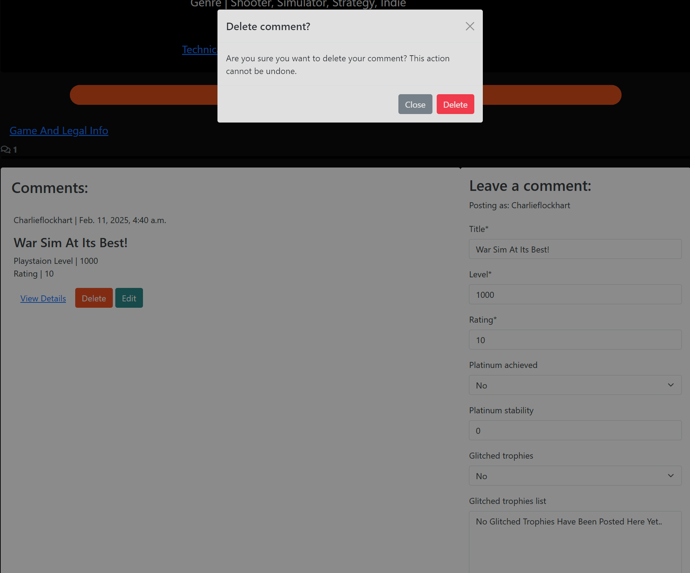

# Playstation Website Study

- Deployed project can be found [here](https://playstation-store-cflockhart-c73e53b52336.herokuapp.com/).

## User experience
### Purpose
- This website is designed to mimic playstations store page with a few improvements. Users can still do what they used to before however now the website has some more 'gamer' related features. 
- It is designed to make the user have a more clear picture of the games they are buying now including patch notes to see if a game is regularly updated, a more expansive review section that includes bug reports etc.
- The target audience of this website would be Playstation based gamers.

## Agile methodology
- 

I have throughout this project followed an agile workflow and methodology. I iterated and bug tested throughout due to the time constraint paired with dailing back on the overall scope of the project once again due to the time constraint. I primarily focused on the must haves and really tried to perfect them before moving onto the next.

At the start of the project i set up a project board to keep track of user stories and my progress on them using the 'To do', 'In Progress' and the 'Done' columns. I created a list of user stories each assigned a 'MOSCOW' prioritisation (must have, should have, could have, won't have) tag. This is following the KanBan method of tracking progress for a better workflow management.

You can see how the project has developed from looking at the original wireframes in the images below to the current deployed website.

### User stories 

As a registered user,
I want to sign in using my email and password,
So that I can access my account and use website features.
- The user enters their registered email and password.
- If credentials are correct, the user is logged in and redirected to the dashboard.
- If credentials are incorrect, an appropriate error message is displayed.

As a user,
I want to see if a game has a Platinum trophy,
So that I know whether I can earn a Platinum for completing all other trophies.
- The game page should display a Platinum trophy text with yes or no if the game includes a Platinum trophy or not.

As a user,
I want to see if the game has won any awards,
So that I can evaluate its recognition and reputation.
- The game page should feature a section dedicated to displaying any awards the game has won.
- Each award should be listed with the following details:
- Award Name (e.g., "Best Game of the Year")
- Awarding Organization (e.g., "The Game Awards")
- Year of Award
- Category (e.g., "Best Action Game")

As a registered user,
I want to purchase a game,
So that I can add it to my library and play it anytime.
- The game details page should have a "Buy Now" button.
- Clicking the button should purchase the game and display a Successful Notification Message.
- Upon successful payment, the game should be added to the user's library.

As a registered user,
I want to leave a comment on a game I purchased,
So that I can share my thoughts and discuss it with others.

I want to rate a game I purchased using a 5-star system,
So that I can share my opinion on its quality.

- The game details page should have a comment section.
- Users can type and submit a comment.
- The comment should be linked to the user’s profile and display the timestamp.
- Comments Should be able to be Created, Edited and Deleted
- Comments should be moderated to prevent spam or inappropriate content.
- The game details page should have a star rating system (1 to 5 stars).
- Users should only be able to rate a game they have purchased.
- The system should allow submitting or updating a rating.
- The average rating should be displayed based on all user reviews.

As a user,
I want to see if the game supports specific hardware features,
So that I can determine if my hardware will provide an enhanced gaming experience.

The game page should indicate if the game supports special hardware features, such as:
- VRR support
- Ray tracing support
- Refresh rate (60hz, 120Hz)
- HDR +10 support
- Storage Size
- Online Play Support
- Online Server Support
- Online Crossplay Support
- Monthly Concurrent players
- Subtitle Support
The hardware features should be clearly labeled with icons or text.

More can be found on the project board.

## Design
### Wireframes 
#### Index Page
- 
#### Games Page
- 
#### Sign In
- 
#### Support
- 
#### Game Details Page
- 

### Colour Scheme 
The colour scheme follows the same as the object of my study, Playstations own website. My aim for this project was to mimic the original website as much as possible hoping to focus on the tech side of the development process. 

### Typography
- Google fonts were used to source the font styles.
- Since the website is based off Playstations own I found a font similar to it and have used it throughout the website. The font that was used was Noto Sans. 

## Images 
For the images i used imported images from Playstations own website as my primary focus of this project was not front end design. 

## Features
### Homepage
- The header is as close to the object of study's header and no new features have been added as of such.

- The homepage is where you'll find a new feature where you can see 'Coming Soon' games in a carousel section, the aim of this is to show users in a dated organised section what is coming soon to the Playstation store. Previously on the original website it is a section rather than a easy to read carousel. 

- The footer is on all pages and is similar to the focus of studies footer, minus the legal information.

- 

### User review
- One of the main things I refined from the object of studies page is the review section, as this is made for gamers I thought it needed a few more key features that it didnt have before. 

New Features:
- Game Version, at time of commenting.
- Playstation Level of commenter,
- Wether Platinum has been achieved by the reviewer,
- Rating for glitchiness for platinum and overall game, 

These features provide more clarity on the game you are purchasing and the user base of it, for example you are more likely to believe a review from someone who has achieved Platinum in a game and if they have a high player level. This brings more honesty to the game reviews.

- 

### Editing a user review 
Players can edit their reviews when signed in and on that game's review section. It looks like below.

- 

### Deleting a user review 
Deleteing a review, is as simple as editing one. The user after posting a review simply clicks delete and confirms in the modal that they would like to delete the comment and its gone. 

- 

### Registering 
Registering an account is done through the top navbar link, by clicking the link you go to the registration page where a Username, Email (Optional) and Password is requested. The user is required to fulfill a specific set of rules for the password for it to work. The email is optional as of right now as if this was linked to the Playstation Database this would connect you to a PS account.

- 

### Logging in 

Logging in is simple it just requires the Username and Password of the user and they have logged in.

- 

### Logging out 

Loggin out can be done through the link in the navbar labbeled 'log out' it takes the user to a log out page which just confirms their want to sign out.

- 

### Game Purchase Page 

- 

### Footer
- Following the original website im basing this project off i used a similar colour scheme, the one difference between the study and my reproduction is i have taken out all the legal links and replaced it with my github and social media links.

- 

## Database
- I used Code Institute's PostgreSQL database.

### Database planning 
- I created ERD Diagrams using DBDiagram.io to plan out the database models and fields.

### Creating a database
1. Navigate to [PostgreSQL]() from Code Institute.
2. Enter your student email address in the input field provided.
3. Click Submit.
4. Wait while the database is created.
5. Check your email.
6. You now have a URL you can use to connect your app to your database.

## Deployment 
- The website was deployed to Heroku and can be found [here](https://playstation-store-cflockhart-c73e53b52336.herokuapp.com/).

### Heroku 
* Heroku is a cloud platform that lets developers create, deploy, monitor and manage apps.
- You will need a Heroku log-in to be able to deploy a website to Heroku.
- Once you have logged into Heroku:
1. Click 'New' > 'Create new app'
2. Choose a unique name, choose your region and press 'Create app'
3. Click on 'Settings' and then 'Reveal Config Vars'
4. Add a key of 'DISABLE_COLLECTSTATIC' with a value of '1'.
5. Add a key of 'DATABASE_URL' - the value will be the URL you were emailed when creating your database.
6. Add a key of 'SECRET_KEY' - the value will be any random secret key (google 'secret key generator' and use it to generate a random string of numbers, letters and characters)
7. In your terminal, type the code you will need to install project requirements:
- pip3 install gunicorn~=20.1
- pip3 install -r requirements.txt
- pip3 freeze --local > requirements.txt
8. Create an 'env.py' file at the root directory which contains the following:
    - import os
    - 
    - os.environ["DATABASE_URL"]='CI database URL'
    - os.environ["SECRET_KEY"]=" Your secret key"
8. Create a file at the root directory called Procfile. In this file enter: "web: gunicorn my_project.wsgi" (without the quotes)
9. In settings.py, set DEBUG to False. 
- YOU SHOULD ALWAYS SET DEBUG TO FALSE BEFORE DEPLOYING FOR SECURITY
10. Add ",'.herokuapp.com' " (without the double quotes) to the ALLOWED_HOSTS list in settings.py
11. Add, commit and push your code.
12. Go back to Heroku, click on the 'Deploy' tab.
13. Connect your project to GitHub.
14. Scroll to the bottom and click 'Deploy Branch' and your project will be deployed!

### Cloning
- To clone a GitHub repository:
1. On GitHub.com, navigate to the repository you want to clone.
2. Click the "Code" button (found above the list of files).
3. Copy the URL for the repository.
4. Open Git Bash or your chosen terminal.
5. Navigate to the directory where you want to clone the repository.
6. Type: git clone https://github.com/charlieflockhart/Playstation-Website-Final-Project.git
7. Press Enter to create your local clone.

### Forking
- 'Forking' the GitHub repository means creating a copy which can be viewed/changed without changing the original.
- To fork a GitHub repository:
1. Login to GitHub and navigate to the repository you want to fork.
2. Click the "Fork" button (found above the Settings button).
3. You will now have a copy of the original repository in your GitHub account.

*Once the project is cloned or forked, in order to run it locally, you'll need to follow these steps:

- Run the server: python3 manage.py runserver
- Stop the app once it's loaded: CTRL+C or ⌘+C
- Make any necessary migrations: python3 manage.py makemigrations
- Migrate the data to the database: python3 manage.py migrate
- Create a superuser: python3 manage.py createsuperuser

## Technologies used 
- HTML was used to structure the content of the website.
- CSS were used to design the layout of the website.
- Bootstrap was used as a CSS framework to provide a grid structure and improve responsiveness.
- Javascript to add extra funcitonality to the website and aid in cross language communication.
- Python and Django were used to build the backend review framework.
- GitHub was used to host the repository and version control.
- Heroku was the hosting platform.

## Testing
- Please see [TESTING.md](TESTING.md) file for all testing.

## AI

#### How I used AI:
I used Copilot and ChatGpt to create, debug and optimize code through out the process to speed up the workflow due to time constraints. Ai's efficiency is a useful tool to work with under time pressure, as although it could have been done all manually it just eased the process and removed some of the larger stresses. 

When it came to Debugging with copilot, I found it useful to highlight the sections of code and ask Copilot to debug why this section had broken. 

When it came to optimazation of the project it was also quite useful in the production and debugging of Media Queries in CSS. Following a similar method as above I found highlighting the specific section that was broken a good way of narrowing the AI's attention onto the specific task at hand. 

In concusion AI affected my workflow and effiency in one big way, it sped along the process by doing the small simple repetitive tasks so i could focus on the more complicated processes as well as debugging large areas of code that would have taken me longer to do manually. When projects are set with small time allocated to them AI is a massive time saver and allows you to really focus on the important aspects of your design and workflow.  

## Credits 

Emma Lamont, Thank you for the ERD check! 

Roo, Spencer and John Rearden, Thank you for all the coaching when the project went downhill. 

Thank you, Richard Fletcher and Megan Otton for the QA testing!

