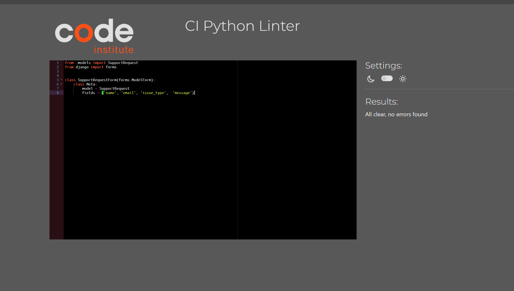

# Testing

- Manual testing was carried out throughout the development of the website and bugs fixed as they arose. 

## Manual testing
- Manual testing was carried out on the local and deployed sites.
                                                                         

## Code validators
### HTML by URL
- The [W3C Validator](https://validator.w3.org/) was used to validate the HTML.
#### Home
- 

#### Games page
- 

#### Games Detail page
- 

#### Register page
- 

#### Logout page
- 

#### Login page
- 

#### Account_Profile page
- 

### HTML by Direct Input
#### Home
- 

#### Games page
- 

#### Games Detail page
- 

#### Register page
- 

#### Logout page
- 

#### Login page
- 

#### Account_Profile page
- 

### CSS custom code
- The [W3C CSS Validator](https://jigsaw.w3.org/css-validator/) was used to validate the CSS.
- 

    

### Javascript custom code
- The [JSHint JS Validator](hhttps://jshint.com/) was used to validate the Javascript.

#### Comments
- 

#### Purchased_Checker
- 

### Python
- The [CI Python Linter](https://pep8ci.herokuapp.com/) was used to validate the Python files.

## Playstation Project
- settings.py
- 
- playstation/urls.py
- 
- asgi.py
- 
- wsgi.py
- 

## Store App
- admin.py
- 
- apps.py
- 
- forms.py
- 
- models.py
- 
- store/urls.py
- 
- views.py
- 

## Support App
- admin.py
- 
- apps.py
- 
- forms.py
- 
- models.py
- 
- support/urls.py
- 
- views.py
- 

## Account_Profile App
- admin.py
- 
- apps.py
- 
- models.py
- 
- account_profile/urls.py
- 
- views.py
- 

### Lighthouse - Mobile
#### Home
- 

#### Games
- 

#### Games Details
- 

#### Register
- 

#### Login
- 

#### Logout
- 

#### Support
- 

#### Account
- 

### Lighthouse - Desktop
#### Home
- 

#### Games
- 

#### Games Details
- 

#### Register
- 

#### Login
- 

#### Logout
- 

#### Support
- 

#### Account
- 

#### Future improvements based on Lighthouse
- 

## Responsiveness
#### Mobile (iPhone 16 Pro)
- 
- 
- 

#### Mobile (iPhone 13 Mini)
- 
- 
- 

#### Tablet (iPad Pro 2024)
- 
- 
- 

#### Desktop (Windows 11)
- 
- 
- 

## Browsers
- I use Google Chrome as my browser so all screenshots above are from Google Chrome.
- 
- The site was tested on Microsoft Edge:
- 
- The site was tested on Opera:
- 

## Bugs
- 