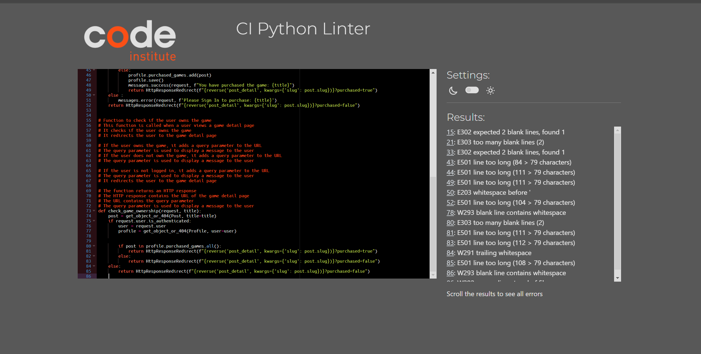

# Testing

- Manual testing was carried out throughout the development of the website and bugs fixed as they arose. 

## Manual testing
- Manual testing was carried out on the local and deployed sites.
                                                                         
|Location       | Feature                 | Expected Outcome                                                | Pass/Fail|
|--------------|-------------------------|-----------------------------------------------------------------|---------|
|Navbar         | Home link               | On click goes to home webpage                                   | Pass     |
|Navbar         | Games link              | On click goes to Games webpage                                  | Pass     |
|Navbar         | Support link            | On click goes to Support webpage                                | Pass     |  
|Navbar         | Register link           | On click goes to the register account page                      | Pass     |  
|Navbar         | Sign In link            | On click goes to Sign in webpage                                | Pass     |
|Navbar         | Account link            | On click goes to Account webpage                                | Pass     |
|Navbar         | Logout link             | On click goes to Sign out webpage                               | Pass     |
|Navbar         | Viewable on all pages   | The navbar to be visible on all webpages                        | Pass     |
|--------------|-------------------------|-----------------------------------------------------------------|---------|
|Support Page   | Live Chat Button        | On click goes to Playstations Live Chat                         | Pass     |    
|Support Page   | Name Input              | Allows User to input their name                                 | Pass     |
|Support Page   | Email Input             | Allows User to input their email                                | Pass     |
|Support Page   | Issue Type Dropdown     | Allows User to select 1 of 3 types of issue                     | Pass     |  
|Support Page   | Message Input           | Allows User to a longer description of their Issue              | Pass     |  
|Support Page   | Submit                  | Allows User to submit their support request                     | Pass     |
|--------------|-------------------------|-----------------------------------------------------------------|---------| 
|Register Page  | Username Input          | Allows User to input their Username                             | Pass     | 
|Register Page  | Email Input             | Allows User to input their Email                                | Pass     | 
|Register Page  | Password Input          | Allows User to input their Password                             | Pass     |
|Register Page  | Password Input 2        | Allows User to input their Password again to confirm            | Pass     |
|Register Page  | Sign Up Button          | Allows User to register their account/ sign up                  | Pass     |
|--------------|-------------------------|-----------------------------------------------------------------|---------|
|Sign In Page   | Username Input          | Allows User to input their Username                             | Pass     |
|Sign In Page   | Password Input          | Allows User to input their Password                             | Pass     |
|Sign In Page   | Remember Me Checkbox    | Allows User to select their info to be remembered               | Pass     |
|Sign In Page   | Sign In Button          | Allows User to Sign into their account if all details = correct | Pass     |
|--------------|-------------------------|-----------------------------------------------------------------|---------|
|Account Page   | Shows Games Purchased   | Allows User to see their purchased games                        | Pass     |
|--------------|-------------------------|-----------------------------------------------------------------|---------|
|Logout Page    | Sign Out Button         | Allows User to sign out of their account                        | Pass     |
|--------------|-------------------------|-----------------------------------------------------------------|---------|
|Home, Games    | Game Cards              | Allows User to select a game to then go to that webpage         | Pass     |
|--------------|-------------------------|-----------------------------------------------------------------|---------|
|Game Info      | Purchase                | Allows User to select purchase that game, if theyre signed in   | Pass     |
|Game Info      | Game Info DropDown      | Allows User to select hide the game info section                | Pass     |
|Game Info      | Technical Info DropDown | Allows User to select hide the Technical Info section           | Pass     |
|Game Info      | Trophies Info DropDown  | Allows User to select hide the Trophies info section            | Pass     |
|Game Info      | Awards Info DropDown    | Allows User to select hide the game's Awards info section       | Pass     |
|Game Info      | Comment Section         | Allows User, if they own the game, to leave a comment           | Pass     |
|Game Info      | Comment Title Input     | When making a comment, Players input becomes the title          | Pass     |
|Game Info      | Playstation Level Input | When making a comment, Players select their PS level            | Pass     |
|Game Info      | Game Rating Input       | When making a comment, Players select their Rating for that game| Pass     |
|Game Info      | Platinum Trophy Dropdown| When making a comment, Players select if theyve got Platinum    | Pass     |
|Game Info      | Platinum Stability Input| When making a comment, Players select if the platinum trophy was stable| Pass     |
|Game Info      | Glitched Trophies Drowdown | When making a comment, Players select if there was glitched trophies| Pass     |
|Game Info      | Glitched Trophies Input     | When making a comment, Players can type in what trophies was glitched| Pass     |
|Game Info      | Game Version Input       | When making a comment, Players select the game version | Pass     |
|Game Info      | Playtime Input       | When making a comment, Players select their playtime for the game | Pass     |
|Game Info      | Platform Dropdown       | When making a comment, Players select what platfrom they are playing on| Pass     |
|Game Info      | Main Comment Input       | When making a comment, Players can input a text based comment | Pass     |
|Game Info      | Comment View Details      | When reviewing the comments it opens the dropdown including all the inputs from above| Pass     |
|Game Info      | Edit Button      | After making a comment and still signed in, allows a user to edit the review | Pass     |
|Game Info      | Update Button       | When editing a comment and still signed in, allows a user to update the review| Pass     |
|Game Info      | Delete Button       | Opens a pop up menu to delete comment | Pass     |
|Game Info      | 'delete comment?' Delete Button       | Deletes the comment | Pass     |
|Game Info      | 'delete comment?' Close Button       | Closes the 'delete comment?' menu. | Pass     |
|--------------|-------------------------|-----------------------------------------------------------------|---------|
|Footer      | Facebook Icon                | Takes user to Playstations Facebook  | Pass     |
|Footer      | Twitter Icon                | Takes user to Playstations Twitter  | Pass     |
|Footer      | Instagram Icon                | Takes user to Playstations Instagram  | Pass     |
|Footer      | Youtube Icon                | Takes user to Playstations Youtube  | Pass     |
|Footer      | Viewable on all pages   |The Footer to be visible on all webpages    | Pass     |
|--------------|-------------------------|-----------------------------------------------------------------|---------|

When it comes to the section about the comments, due to not being linked to the playstations database the comment inputs about Playstation Level, Game Version and Platinum Achieved have had to be done manually due to not being able to pull the data from a accurate database like it would be if i had access to the relevant Playstations Data.

## Code validators
### HTML by URL
- The [W3C Validator](https://validator.w3.org/) was used to validate the HTML.
#### Home
- 

#### Games page
- 

#### Games Detail page
- 
- This had an error due to summeradmin using font color in its form which is something I can't edit or change.  

#### Register page
- 
- Very similar error, this is due to signup in its form using to many or unsupported tags and elements

#### Logout page
- 

#### Login page
- 

#### Account_Profile page
- 
- This was an error due to not being able to login as this was using the HTML by URL 

### HTML by Direct Input
#### Home
- 

#### Games page
- 

#### Games Detail page
- 
- This had an error due to summeradmin using font color in its form which is something I can't edit or change.  

#### Register page
- 
- Very similar error, this is due to signup in its form using to many or unsupported tags and elements

#### Logout page
- 

#### Login page
- 

#### Account_Profile page
- 

### CSS custom code
- The [W3C CSS Validator](https://jigsaw.w3.org/css-validator/) was used to validate the CSS.
- 

    

### Javascript custom code
- The [JSHint JS Validator](hhttps://jshint.com/) was used to validate the Javascript.

#### Comments
- 

#### Purchased_Checker
- 

### Python
- The [CI Python Linter](https://pep8ci.herokuapp.com/) was used to validate the Python files.

## Playstation Project
- settings.py
- 
- playstation/urls.py
- 
- asgi.py
- 
- wsgi.py
- 

## Store App
- admin.py
- 
- apps.py
- 
- forms.py
- 
- models.py
- 
- store/urls.py
- 
- views.py
- 

## Support App
- admin.py
- 
- apps.py
- 
- forms.py
- 
- models.py
- 
- support/urls.py
- 
- views.py
- 

## Account_Profile App
- admin.py
- 
- apps.py
- 
- models.py
- 
- account_profile/urls.py
- 
- views.py
- 

### Lighthouse - Mobile
#### Home
- 

#### Games
- 

#### Games Details
- 

#### Register
- 

#### Login
- 

#### Logout
- 

#### Support
- 

#### Account
- 

### Lighthouse - Desktop
#### Home
- 

#### Games
- 

#### Games Details
- 

#### Register
- 

#### Login
- 

#### Logout
- 

#### Support
- 

#### Account
- 

#### Future improvements based on Lighthouse
- 

## Responsiveness
### Mobile (iPhone 16 Pro)
- 
- 
- 

### Mobile (iPhone 13 Mini)
- 
- 
- 

### Tablet (iPad Pro 2024)
- 
- 
- 

### Laptop (Windows 11)
- 
- 
- 

## Browsers
- I use Google Chrome as my browser so all screenshots above are from Google Chrome.
- 
- The site was tested on Microsoft Edge:
- 
- The site was tested on Opera:
- 

## Bugs
- 
